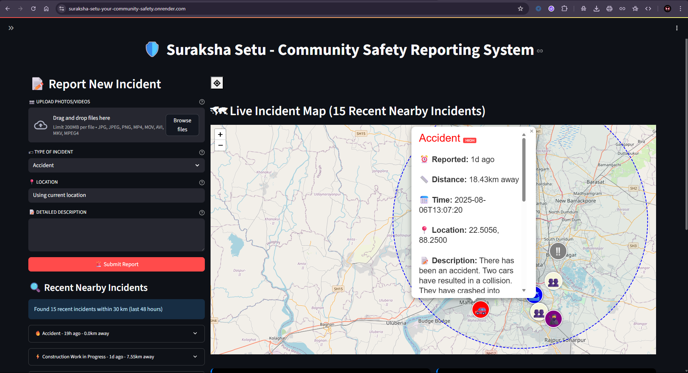

# 🛡️ Suraksha Setu – AI-Powered Public Safety Incident Reporting & Awareness Platform

Suraksha Setu is an **Agentic AI-powered public safety platform** that enables citizens to **report, view, and stay informed about real-time incidents** in their vicinity.  
Whether it’s **accidents, waterlogging, fires, or other hazards**, users can instantly access **hyperlocal safety intelligence** and plan their routes accordingly.

https://suraksha-setu-your-community-safety.onrender.com/
---

## Project image

  

## 🚀 Features

### 🔍 Real-Time Incident Map
- View all nearby incidents on an **interactive map**.
- Click on markers to see detailed incident information (type, urgency, severity, location).

### 📝 Easy Incident Reporting
- Submit incidents with:
  - Category (Accident, Waterlogging, Fire, etc.)
  - Automatic GPS location
  - Description
  - **Photo/Video uploads** for evidence

### 🤖 Agentic AI Classification
- Incidents are analyzed using **Agentic AI with LLM (Ollama)**.
- Automatically tags:
  - **Incident Type**
  - **Urgency Level**
  - **Severity Score**

### 📍 Nearby Incident Alerts
- See incidents within a **25 km radius** in real-time.
- Helps users **plan safe travel routes**.

### ⚡ Multi-Platform Support
- Web application with responsive design.
- Future integration with **Telegram bots** for public forums.

---

## 🛠 Technology Stack

| Component         | Technology |
|-------------------|------------|
| **Frontend**      | Leaflet.js (Maps), Streamlit UI |
| **Backend**       | FastAPI  |
| **Database**      | FireBase Cloud Fire store |
| **AI/ML**         | LangChain ,Agentic AI, LLM:Gemini-1.5-Flash-latest|
| **Deployment**    | Using Render |

---
